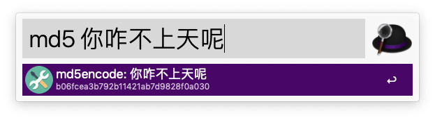
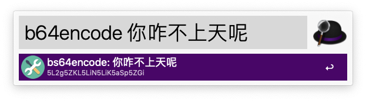

# behelper

> behelper is an alfred workflow

下载链接: https://github.com/istommao/behelper/raw/master/behelper.alfredworkflow

## unicode 转中文

> 命令: unicode

## RFC link

- rfc

## httpcode

> 查询 http状态码

## ascii

- ascii ord
- ascii chr

## md5 encode

> 命令: md5

## base64 encode

> 命令: b64encode

## base64 decode

> 命令: b64decode

## Length calc

> 命令: len

## Check id card

